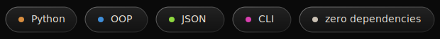
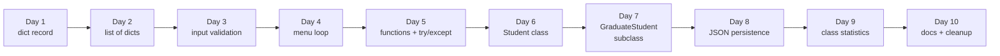

<div align="center">



<br><br>



</div>

<br>

## What this is

A command-line student record system, built from a bare dictionary on day one into a small
object-oriented system with inheritance, file persistence, and basic statistics by day ten.

It's not trying to be impressive as software — it's a controlled space to make real engineering
decisions on purpose, and write down *why*, before doing the same thing on bigger projects where
the stakes (and the noise) are higher.

Every day below follows the same shape: **what I was solving for → what I chose → what I didn't
choose, and why not.** No line-by-line code walkthroughs — those are in the code itself, as
comments. This is the reasoning that doesn't show up in a diff.

<br>

## Code, day by day

Each entry below links to the actual `app.py` as it existed at the end of that day — not the
final version, the real snapshot.

| Day | Snapshot | What changed |
|---|---|---|
| 1 | [view code](https://github.com/HamzaButt22/student-management-system/blob/76c0604d6e90ad75fb57c5a54248022312f789e5/app.py) | dict-based single record |
| 2 | [view code](https://github.com/HamzaButt22/student-management-system/blob/56d74e21dfc9ba98a9571325261e108fffbc38f6/app.py) | list of dicts, multiple records |
| 3 | [view code](https://github.com/HamzaButt22/student-management-system/blob/68a9b1843cb6aeeb1a76ff5c9bad365660cd42ac/app.py) | input validation |
| 4 | [view code](https://github.com/HamzaButt22/student-management-system/blob/a124fbc464e72a59a49117d82b41201a511b9eb2/app.py) | menu loop, search |
| 5 | [view code](https://github.com/HamzaButt22/student-management-system/blob/48a0ac8c46829f96a6b157c86a2c53be889cf75a/app.py) | functions + try/except |
| 6 | [view code](https://github.com/HamzaButt22/student-management-system/blob/91cea2c4e50e5b72d527846fa2999cc80364e554/app.py) | Student class (OOP) |
| 7 | [view code](https://github.com/HamzaButt22/student-management-system/blob/132c0cd20482ce304093d2856d41c5ce0ec2038b/app.py) | GraduateStudent subclass |
| 8 | [view code](https://github.com/HamzaButt22/student-management-system/blob/4536bf0fe4e6c0f7332c5bd53c2115db28340c8e/app.py) | JSON persistence |
| 9 | [view code](https://github.com/HamzaButt22/student-management-system/blob/7c4359c02708a308ed88fd78b1d5bde7157f4965/app.py) | class statistics |
| 10 | [view code](https://github.com/HamzaButt22/student-management-system/blob/006396000ef5ef813510a03551aabb850e0efc8e/app.py) | docs + cleanup |

<br>

## Run it

```bash
git clone https://github.com/HamzaButt22/student-management-system.git
cd student-management-system
python3 app.py
```

No dependencies outside the standard library.

<br>

## How it grew



<div align="center"></div>

## The decision log

<details>
<summary><b>Day 1 — A dictionary before a class</b></summary>
<br>

**Solving for:** a way to hold one student's data (name, ID, GPA) without over-building on day one.

**Decision:** a plain dictionary, not a class.

**Why not a class yet:** a class buys you structure you don't need until you have behavior to
attach to the data — validation, display logic, more than one record. On day one there was
exactly one record and zero behavior. Reaching for a class here would have been solving a
problem I didn't have yet, at the cost of understanding what a class is actually *for* when I
got there on day 6.

</details>

<details>
<summary><b>Day 2 — A list of dicts, not a dict of dicts</b></summary>
<br>

**Solving for:** storing more than one student.

**Decision:** `list[dict]`, keyed by nothing — iterate to find someone.

**Alternative considered:** a dict keyed by student ID, which would make lookup O(1) instead of
O(n).

**Why the list won anyway:** at this stage the record count is tiny and the actual task was
learning to model *collections* of records, not optimize lookup. Indexed lookup by ID becomes
the right call once search performance is actually a problem — which is closer to what real
databases solve, and part of why file/DB-backed storage shows up later instead of trying to hand
-roll an index here.

</details>

<details>
<summary><b>Day 3 — Reject bad input at the edge, not deep in the logic</b></summary>
<br>

**Solving for:** GPA and ID fields that could otherwise hold garbage.

**Decision:** validate at the point of input, before a bad value ever enters the record.

**Alternative considered:** let bad data in and check for it wherever it's used later.

**Why not that:** validating late means every downstream function has to defend itself against
malformed data, which multiplies the number of places a bug can hide. Catching it once, at the
door, means everything after that point can trust the shape of the data.

</details>

<details>
<summary><b>Day 4 — A loop-driven menu instead of a one-shot script</b></summary>
<br>

**Solving for:** running add / view / search more than once without restarting the program.

**Decision:** a `while True` loop with a numbered menu, `break` on exit.

**Trade-off accepted:** a menu loop is more state to manage than a script that just runs top to
bottom once — but a program that dies after one action isn't really a "system," it's a demo.
This was the point where it started behaving like something a person could actually use.

</details>

<details>
<summary><b>Day 5 — Functions and try/except before OOP, not after</b></summary>
<br>

**Solving for:** four days of accumulated, copy-pasted logic.

**Decision:** pull repeated logic into functions and wrap user input / file actions in
`try/except`, *before* converting anything to classes.

**Why in this order:** refactoring into functions first exposes exactly which pieces of logic
belong together — which is the same information you need to draw class boundaries well. Jumping
straight to OOP on messy code just gives you messy classes instead of messy functions.

</details>

<details>
<summary><b>Day 6 — A Student class, once there was something to attach to it</b></summary>
<br>

**Solving for:** the same record + display + update logic as before, restructured.

**Decision:** a `Student` class, with the prior week's record dict becoming its state and the
free functions becoming its methods.

**Why now and not day one:** this is the point OOP actually pays for itself — there's now real
behavior (validation, display, update) that belongs *with* the data instead of floating
alongside it. Same functionality as Friday, different ownership of the logic.

</details>

<details>
<summary><b>Day 7 — Subclassing instead of an "is_graduate" flag</b></summary>
<br>

**Solving for:** graduate students, who need one extra field (thesis topic) and a different
display format.

**Decision:** a `GraduateStudent` subclass overriding `display()`.

**Alternative considered:** a boolean flag on `Student` plus an `if` branch inside `display()`.

**Why not the flag:** a flag works for one extra case, but every additional student type would
mean another branch inside an already-shared method — logic for unrelated student types starts
piling up in one place. A subclass keeps each type's special-casing local to itself instead of
threaded through the parent class.

</details>

<details>
<summary><b>Day 8 — JSON, not a database, for persistence</b></summary>
<br>

**Solving for:** records disappearing every time the program closes.

**Decision:** save/load to a `.json` file.

**Alternative considered:** SQLite.

**Why JSON for now:** SQLite is the right call once there's concurrent access, querying, or a
record count where reading the whole file into memory stops being free — none of which is true
here yet. JSON keeps the persistence layer readable and inspectable while the project is still
this size, and the migration path to a real database later is a swap of *how* records are
saved, not a rewrite of what the program does.

</details>

<details>
<summary><b>Day 9 — Computing statistics manually, then checking against NumPy</b></summary>
<br>

**Solving for:** class-wide GPA stats (mean, median, mode, standard deviation).

**Decision:** implement each manually first, then verify the output against NumPy's version.

**Why not just call NumPy and move on:** using NumPy from the start would have gotten a correct
number without the underlying arithmetic — verifying my own version against it was the actual
point of the exercise. NumPy is what I'd use in a real project going forward; this day was for
making sure I trust it because I understand it, not just because it's a library.

</details>

<details>
<summary><b>Day 10 — Cleanup as a decision, not just a chore</b></summary>
<br>

**Solving for:** ten days of iterative changes, some of it now outdated.

**Decision:** docstrings on every method, a rewritten README, and one pass to remove logic that
earlier decisions had already made obsolete (e.g. dict-based validation left over from before
the class existed).

**Why this matters:** the code that's easiest to trust isn't the code with the most comments —
it's the code with nothing left in it that contradicts its own most recent decision.

</details>

<br>

## What's next

This project is the first of several from an 8-week AI/ML internship track. The rest — an EDA
project, a classical ML model comparison, and a full-stack capstone — will link back to a hub
repository once they're built the same way this one was.

</div>